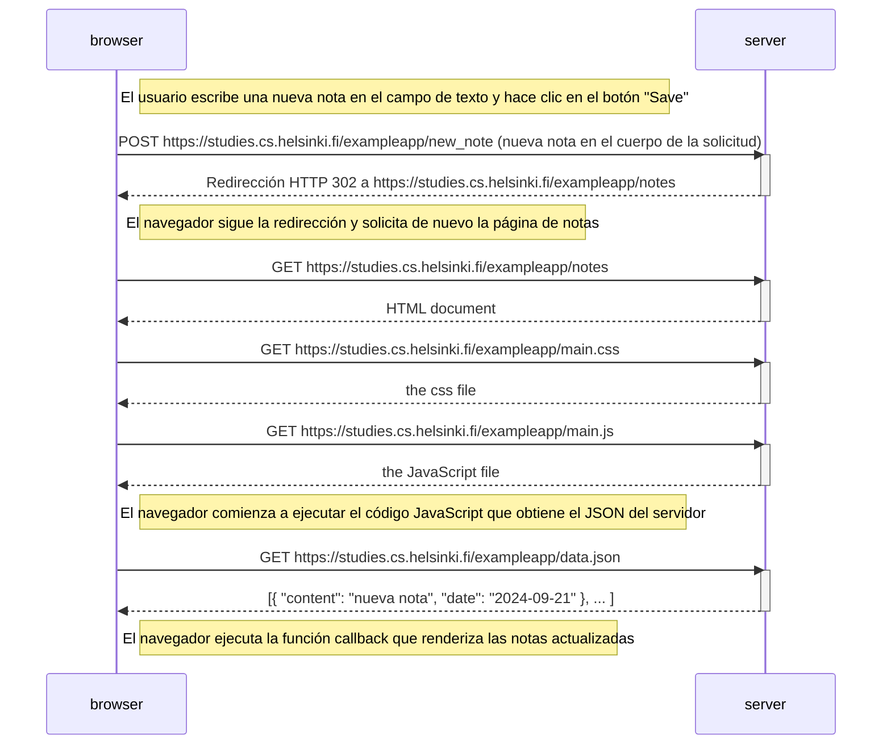

# 0.4: Diagrama de nueva nota

## Código Mermaid

```
sequenceDiagram
    participant browser
    participant server

    Note right of browser: El usuario escribe una nueva nota en el campo de texto y hace clic en el botón "Save"
    
    browser->>server: POST https://studies.cs.helsinki.fi/exampleapp/new_note
    activate server
    server-->>browser: Redirección HTTP 302 a https://studies.cs.helsinki.fi/exampleapp/notes
    deactivate server

    Note right of browser: El navegador sigue la redirección y solicita de nuevo la página de notas

    browser->>server: GET https://studies.cs.helsinki.fi/exampleapp/notes
    activate server
    server-->>browser: HTML document
    deactivate server

    browser->>server: GET https://studies.cs.helsinki.fi/exampleapp/main.css
    activate server
    server-->>browser: the css file
    deactivate server

    browser->>server: GET https://studies.cs.helsinki.fi/exampleapp/main.js
    activate server
    server-->>browser: the JavaScript file
    deactivate server

    Note right of browser: El navegador comienza a ejecutar el código JavaScript que obtiene el JSON del servidor

    browser->>server: GET https://studies.cs.helsinki.fi/exampleapp/data.json
    activate server
    server-->>browser: [{ "content": "Nueva nota", "date": "2024-09-21" }, ... ]
    deactivate server

    Note right of browser: El navegador ejecuta la función callback que renderiza las notas actualizadas
```

## Diagrama de secuencia


