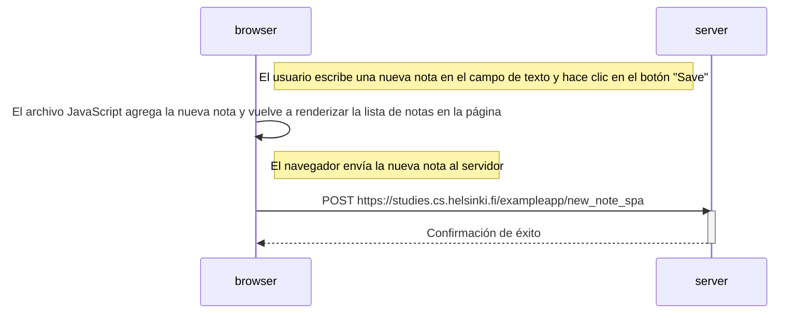

# 0.6: Diagrama de nueva nota en aplicación de una sola página

## Código Mermaid

```
sequenceDiagram
    participant browser
    participant server

    Note right of browser: El usuario escribe una nueva nota en el campo de texto y hace clic en el botón "Save"

    browser->>browser: El archivo JavaScript agrega la nueva nota y vuelve a renderizar la lista de notas en la página

    Note right of browser: El navegador envía la nueva nota al servidor

    browser->>server: POST https://studies.cs.helsinki.fi/exampleapp/new_note_spa
    activate server
    server-->>browser: Confirmación de éxito
    deactivate server
```

## Diagrama de secuencia


